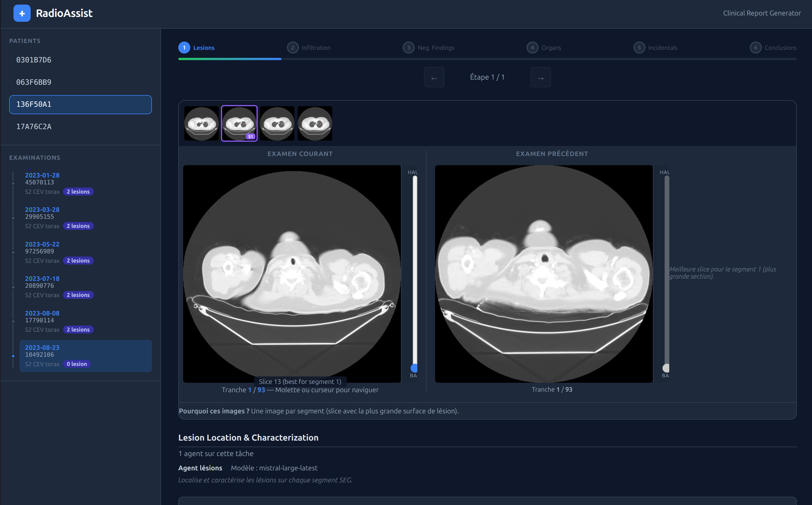

# RadioAssist — Clinical Report Generator

> AI-powered assistant for oncology radiology report writing, built with FastAPI and Mistral AI vision agents.

**RadioAssist** is an application designed to assist radiologists in writing structured oncology reports from DICOM exams (thoracic, abdominal and pelvic CT scans). It combines deterministic analysis with LLM-based agents, built during the Hackathon Unboxed 2026 in Lyon.

---

## Overview

RadioAssist automates the analysis of medical images while keeping the radiologist in control at every step (*human-in-the-loop*).

The application takes DICOM data (CT images, segmentation masks, structured reports) along with clinical information (Excel file) as input, and produces a comprehensive report covering:

- **Lesion localization and characterization**
- **Infiltration assessment** (vessels, adjacent structures)
- **Negative findings** (normal structures)
- **Organ assessments**
- **Incidental findings**
- **Conclusions** with recommendations and RECIST classification

---

## Features

### Report Generation

- **Quick Generate**: one-shot generation (~30 s) without intermediate validation.
- **Generate Report**: interactive 6-step pipeline with validation and the ability to re-run each step.

### Interactive Pipeline

The report is built progressively in 6 steps. At each step, the radiologist can validate, manually edit, or re-run the agent with a remark:

1. **Lesions** — anatomical localization, characterization, confidence level
2. **Infiltration** — level (none, simple contact, suspicion, certain) and indicators
3. **Negative findings** — identified normal structures
4. **Organ assessments** — normal vs abnormal status per organ
5. **Incidental findings** — unexpected anomalies
6. **Conclusions** — summary, recommendation, RECIST classification

### Visualization

- Image carousel with segmentation mask overlay
- 3D volume navigation (slice slider)
- Side-by-side comparison with previous exam

### Export

- Text copy
- JSON export
- PDF export (via jsPDF)

---

## Architecture

```
Hackathon-Lyon/
├── main.py                         # FastAPI entry point
├── requirements.txt
├── .env                            # Mistral API key
│
├── app/                            # Frontend (vanilla HTML / CSS / JS)
│   ├── index.html
│   ├── style.css
│   └── app.js
│
├── src/
│   ├── api/                        # HTTP controllers & services
│   │   ├── report_controller.py    #   /api/v1/reports routes
│   │   ├── image_service.py        #   Image preparation
│   │   └── session_manager.py      #   In-memory session management
│   │
│   ├── domain/                     # Pydantic models (business entities)
│   │   ├── clinical_report.py
│   │   ├── report_findings.py
│   │   ├── report_determinist.py
│   │   ├── report_agent.py
│   │   └── ...
│   │
│   ├── agents/                     # LLM agents (Mistral vision + text)
│   │   ├── lesions_agent.py
│   │   ├── infiltration_agent.py
│   │   ├── negative_findings_agent.py
│   │   ├── organ_assessments_agent.py
│   │   ├── incidental_findings_agent.py
│   │   ├── conclusions_agent.py
│   │   ├── remark_guard_agent.py
│   │   └── ...
│   │
│   ├── determinist/                # Deterministic analysis (no LLM)
│   │   ├── report_determinist/
│   │   │   ├── builder.py          #   Report construction
│   │   │   ├── recist.py           #   RECIST 1.1 calculations
│   │   │   └── seg_analyzer.py     #   Segmentation analysis
│   │   └── advanced_metrics/       #   Advanced metrics (TGR, heterogeneity)
│   │
│   ├── services/                   # External services
│   │   ├── llm_service.py          #   Mistral AI client
│   │   └── llm_prompt_service.py   #   Prompt building
│   │
│   ├── repositories/               # Data access
│   │   ├── data_repo.py            #   DICOM reading
│   │   └── liste_examen_repo.py    #   Excel reading
│   │
│   └── uses_cases/                 # Use cases
│       ├── create_last_report.py
│       └── interactive_pipeline.py
```

### Data Flow

```
DICOM data (CT, SEG, SR)  ──┐
                             ├──▶  ExamContext  ──▶  Deterministic analysis (RECIST, volumes)
Clinical data (Excel)     ──┘                   ──▶  LLM agents (Mistral vision)
                                                            │
                                                            ▼
                                                    ClinicalReport
```

---

## Tech Stack

| Component | Technology |
|-----------|------------|
| Backend | **FastAPI** + uvicorn |
| LLM | **Mistral AI** (`mistral-large-latest`, vision) |
| Medical imaging | SimpleITK, MONAI, OpenCV, scikit-image |
| DICOM | pydicom, dicom2nifti, nibabel |
| Clinical data | pandas, openpyxl |
| Frontend | Vanilla HTML / CSS / JS, jsPDF |
| Configuration | python-dotenv |

---

## Getting Started

### 1. Create a virtual environment

```bash
python3 -m venv env
```

### 2. Activate the virtual environment

**macOS / Linux:**
```bash
source env/bin/activate
```

**Windows (PowerShell):**
```powershell
.\env\Scripts\Activate.ps1
```

**Windows (cmd):**
```cmd
.\env\Scripts\activate.bat
```

Once activated, the `(env)` prefix appears in your terminal.

### 3. Configure the API key

Copy `.env_template` to `.env` and fill in your Mistral API key:

```bash
cp .env_template .env
```

### 4. Install dependencies

```bash
pip install -r requirements.txt
```

### 5. Run the application

From the project root (with the virtual environment activated):

```bash
uvicorn main:app --reload
```

The interface will be available at: **http://localhost:8000**

- `--reload` automatically restarts the server when you edit code (optional, for development).

---

## Useful Commands

| Action | Command |
|--------|---------|
| Deactivate venv | `deactivate` |
| Upgrade pip | `pip install --upgrade pip` |

---

## Screenshots

<!-- Replace the paths below with your actual screenshots -->




